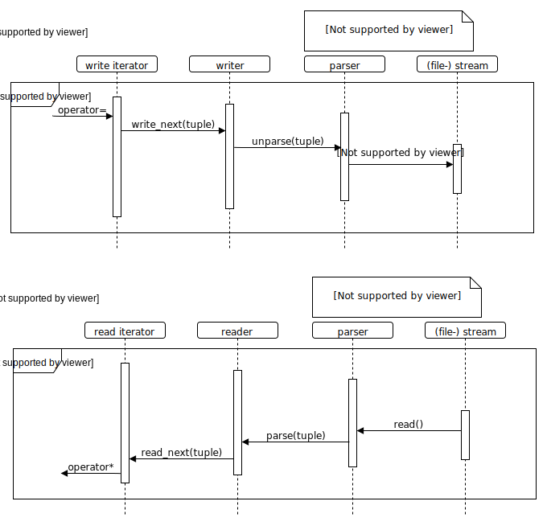
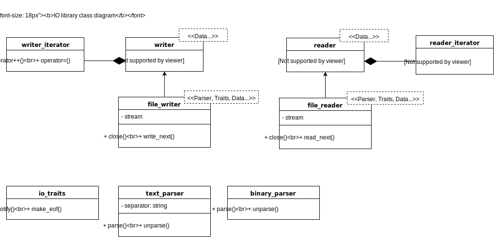

ifdef::env-github[]
:tip-caption: :bulb:
endif::[]

== generic_io library

.Build status 
Ubuntu 18.10, GNU GCC 8.3: image:https://rgijsen.visualstudio.com/generic_io/_apis/build/status/rgijsen.generic_io?branchName=master["Build Status",
link=https://rgijsen.visualstudio.com/generic_io/_build/latest?definitionId=1&branchName=master]

=== Description
Type-safe custom reader and writer components for I/O (file-) streams. Customized to read and write column-based data, e.g. the xyz-format. The columns and their data types are defined during instantation using a variadic template parameter list.
Using the I/O iterators the STL algorithms can be used for data processing.

.Minimal sample code:
[source,c++, indent=0]
// include::src/examples/single_type_example.cpp[tag=code_example]
----
// read two-column input of type string and, double
std::vector<std::pair<std::string, double>> data; // <1>
auto reader = storage::text_file_reader_t<std::string, double>("filename");
std::transform(reader.begin(), reader.end(), std::back_inserter(data), 
{
  return std::make_pair( std::get<0>(a), std::get<1>(a) ); 
});
----
// <1> output data container (the read data is inserted into this container)
// <2> define the reader with the (variadic) types of the data to read
// <3> STL transform algorithm for iterating over the data

=== Spec
* Header file only
* C++17 
* I/O parsers for plaintext and binary format
* Writers for file-based and standard output (std::cout) streams
* Reader for file-based input stream
* Support for plaintext and binary format

=== Examples
* Single type
* Aggregated types (plain text and binary)
* XYZ format

=== Details
The I/O library has a compositional setup.
The main components are the reader and writer. Template parameters Parser and Traits set the data parser and stream traits respectively. Additional, the data columns and their type(s) are specified as template parameters.
Type aliases are supplied for file stream. Only the data column types need to be specified. E.g. defining a binary file writer with int and float column looks like this: _auto writer = binary_file_writer_t<int, float>_

Since functions, and thus iterators, can only return one value the multiple data columns are aggregated into a tuple type. The parser folds (for reading) and unfolds (for writing) the individual data elements for further processing.

The plaintext parser uses the << operator to write the individual data elements to stream. So custom types need to have the << operator available.
For reading the plaintext parser has a string_converter. Custom types can be added to this converter.

As can be seen in the sequence diagram below, the writer actually writes data to the stream when the iterator assigment operator, operator=(), is called. This operator gets 
invoked by the STL algorithms. 
Simularly, the reader reads from stream when the iterator pointer operator, operator*(),is invoked by a STL algorithm.

[icon="resources/note.png"]
[TIP]
To support the reading and writing of header/metadata lines in a file, the read_next() and write_next() functions can be called directly without the use of iterators. As header lines are not of the same type as the columns data, the reader read_next() function requires to be called with the header line type specified, e.g. reader.read_next<std::string>(). For the writer write.next() function the compiler can infer the types automatically.

.Sequence diagram

The class diagram below shows the classes and there relationships.
The parser and traits classes are composition classes of the reader and writer classes. 

The parser class holds the parse and unparse functions. The parse function folds the aggregated type (the tuple) to file. The unparse function reads the columns from file and creates a tuple where each tuple element matches a column. The column data types are specified when instantiating the writer or reader object.

The traits class has a notify function which can be used for logging. The reader and writer notify the filename that is being openend and if the plaintext of binary format is used.

.class diagram

=== 2do (maybe)
* add column separator (probably to io_traits)
