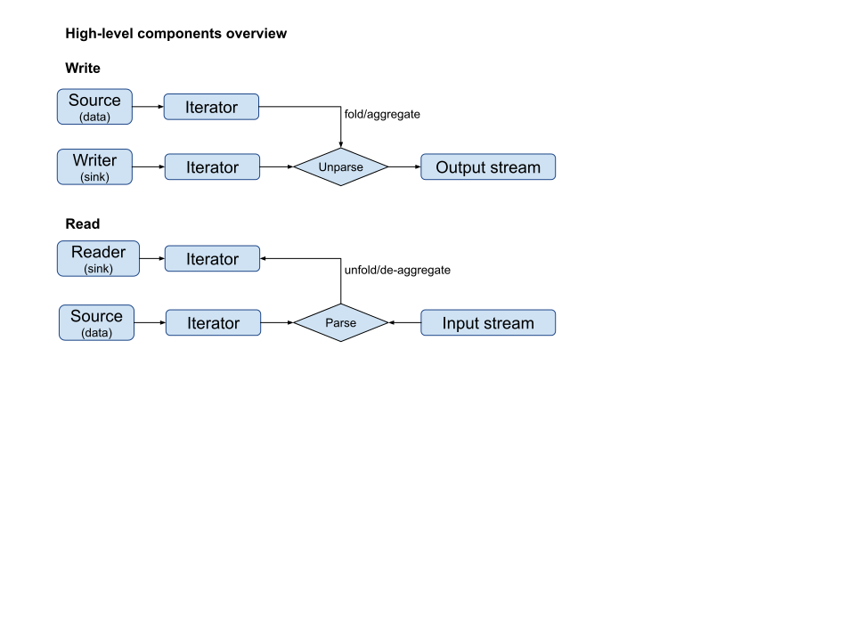

:stylesheet: asciidoctor.css
== generic_io library

.Build status 
Ubuntu 18.10, GNU GCC 8.3: image:https://rgijsen.visualstudio.com/generic_io/_apis/build/status/rgijsen.generic_io?branchName=master["Build Status",
link=https://rgijsen.visualstudio.com/generic_io/_build/latest?definitionId=1&branchName=master]

=== Description
Type-safe generic reader and writer components for I/O (file-) streams. Using the I/O iterators functional composition with the STL algorithms is possible.

.Minimal sample code:
// [source,c++, indent=0]
// include::src/examples/single_type_example.cpp[tag=code_example]
----
// read two-column input of type string and, double
std::vector<std::pair<std::string, double>> data; // <1>
auto reader = storage::text_file_reader_t<std::string, double>("filename"); // <2>
std::transform(reader.begin(), reader.end(), std::back_inserter(data),  // <3>
{
  return std::make_pair( std::get<0>(a), std::get<1>(a) ); 
});
----
<1> output data container (the read data is inserted into this container)
<2> define the reader with the (variadic) types of the data to read
<3> STL transform algorithm for iterating over the data

=== Spec
* Header file only
* C++17 
* I/O parsers for plain text and binary format
* Writers for file-based and standard output (std::cout) streams
* Reader for file-based input stream
* Suport for plaintext and binary format

=== Examples
* Single type
* Aggregated types (plain text and binary)
* XYZ format

=== Details
The reader and writer are compositional setup
[white-background]#test#

